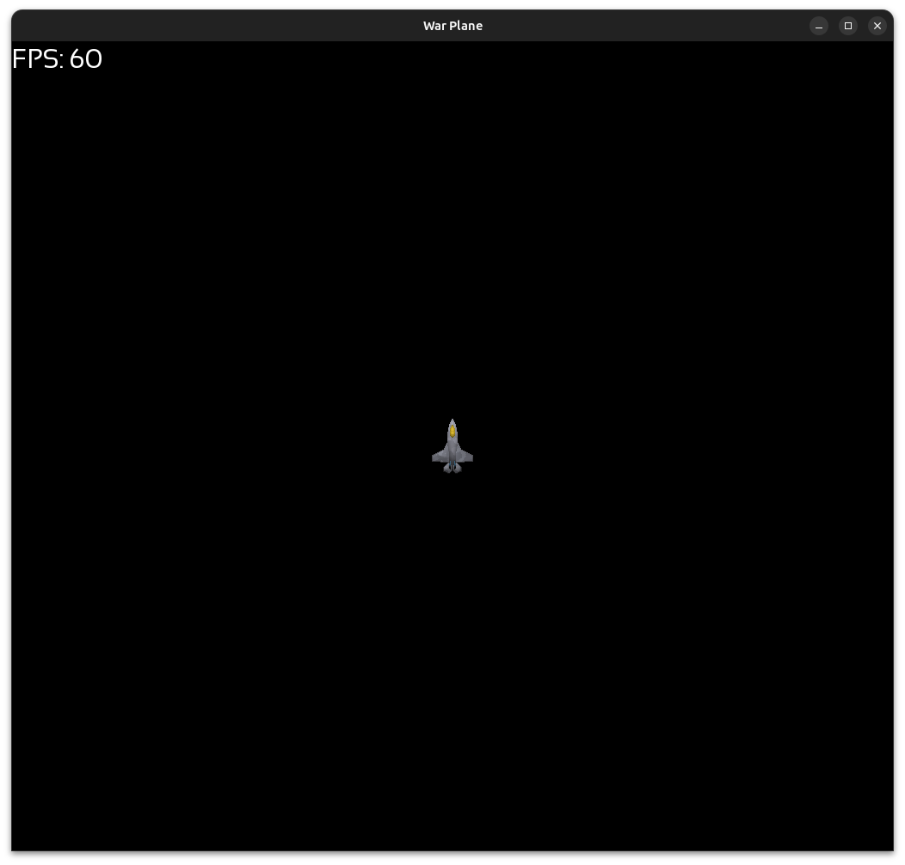

# Warplane Game

A 2D warplane game developed with SFML (Simple and Fast Multimedia Library) in C++.



## Features

- Player-controlled warplane
- Enemy AI
- Projectile system
- Collision detection
- Score tracking

## Requirements

- C++11 or later
- SFML 2.5+
- CMake 3.10+

## Building

```bash
mkdir build
cd build
cmake ..
make
```

## Running

```bash
./warplane
```

## Controls

- **Arrow Keys**: Move
- **Space**: Shoot
- **ESC**: Quit

## Project Structure

```txt
warplane/
├── src/
│   ├── main.cpp
│   ├── game.cpp
│   └── player.cpp
├── include/
│   ├── game.h
│   └── player.h
└── CMakeLists.txt
```
